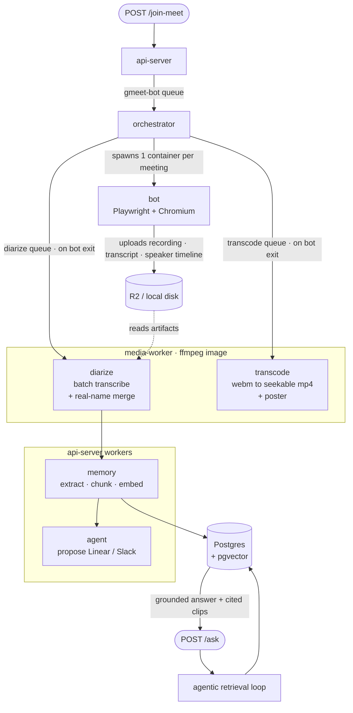

# Raven

A meeting bot that joins your Google Meet calls, records and transcribes them, remembers what was said, and can answer questions about them later — with citations that link back to the exact second in the recording.

It is built as three small services plus a retrieval/agent layer:

- A **bot** that joins a Meet call as a participant, records the mixed audio/video, live-transcribes it, and tracks who was speaking when.
- An **orchestrator** that runs one throwaway bot container per meeting.
- An **api-server** that dispatches bots, ingests finished meetings into a searchable memory, and serves an agentic `/ask` endpoint that answers questions across every meeting you've recorded.

The interesting problems here aren't the CRUD — they're capturing per-speaker audio from a black-box SFU, turning messy transcripts into grounded structured memory, and answering questions in a way that cites its evidence or refuses. Those are written up in [Design decisions](#design-decisions) below.

---

## How it fits together

A meeting moves through the system in two passes. **Capture:** the API dispatches a bot, which joins the call, records it, and stores the artifacts. **Post-processing:** four workers turn those artifacts into searchable memory, one hop at a time. Questions run separately, back over that memory.



Redis backs every queue; Postgres with pgvector holds the memory. Each stage is its own queue drained by its own worker process, and a meeting is handed from one to the next as each finishes.

The split between the two worker groups is deliberate. `transcode` and `diarize` are ffmpeg-bound and touch the database with five `UPDATE meetings` statements, so they run as their own service on an image that carries ffmpeg. `memory` and `agent` *are* the domain layer — they write five tables transactionally — so they run the api-server image, triggered by a queue instead of by HTTP. See [docs/decisions.md](docs/decisions.md) D1 and D6.

---

## What each service does

### `bot/` — the recorder (Playwright + Chromium + Deepgram)

Joins a meeting using a saved, signed-in Google session, then:

- **Records** the call with `getDisplayMedia`, compositing every participant's audio into one stream via the Web Audio API.
- **Live-transcribes** that mixed stream through Deepgram over a single WebSocket.
- **Tracks the speaker timeline** — see [the audio problem](#per-participant-audio-is-impossible-on-meet) for why this is its own subsystem rather than a diarization flag.
- **Uploads** the `.webm`, transcript, and speaker timeline to Cloudflare R2 (S3-compatible), falling back to local disk when R2 isn't configured.

Runs headed inside Xvfb in Docker (headless Chromium gets Google's "you can't join this call" wall).

### `orchestrator/` — the scheduler (Dockerode + BullMQ)

Consumes the `gmeet-bot` queue and spawns one `meet-bot:latest` container per meeting, binding in the saved Google auth state and a recordings volume. **One container per meeting, not a worker pool** — meetings run for hours, so pooled workers would block the queue; you scale by launching more containers. When a bot exits it enqueues a `diarize` job.

### `api-server/` — the brain (Express + Drizzle + OpenAI)

The single REST surface, plus the two domain workers:

- **`memory` worker** ([ingestMeeting.ts](api-server/src/domain/ingest/ingestMeeting.ts)) — extracts a minimal universal spine (decisions, action items, chapters, summary, a soft meeting-type label) via OpenAI structured outputs, chunks the transcript by speaker turn, embeds the chunks, and writes everything in one idempotent transaction. A hallucination guard drops any decision/action whose evidence quote isn't a literal substring of the transcript.
- **`agent` worker** — proposes external actions (a Linear issue per action item, a templated Slack recap) into an `agent_actions` ledger with status `proposed`. Nothing fires until a human approves it.

Retrieval lives here too: [hybridSearch.ts](api-server/src/domain/search/hybridSearch.ts) fuses pgvector cosine search and Postgres full-text search with Reciprocal Rank Fusion in a single SQL query, and [ask.ts](api-server/src/domain/agent/ask.ts) runs the agentic answer loop.

### `media-worker/` — the encoder (ffmpeg + Deepgram batch)

The only service that needs ffmpeg, which is why it has its own image.

- **`transcode` worker** — remuxes the bot's live WebM into a seekable mp4 plus a poster frame. The raw capture has no duration and no cues, so a browser cannot seek it and every `#t=` citation would be unplayable. Its own queue rather than a diarize stage: an hour-long encode would park every later meeting's transcript behind it.
- **`diarize` worker** — pulls the recording and speaker timeline from the artifact store, extracts audio, runs Deepgram batch (nova-3, diarization) with participant names fed in as keyterms, then interval-vote-joins the anonymous diarizer labels against the speaker timeline to get **real names**. Writes a `named-transcript.jsonl` and enqueues ingest.

It reaches Postgres with raw `pg` rather than the Drizzle schema — five write statements is the whole contract, and [schema.test.ts](media-worker/src/schema.test.ts) checks those column names against the migrations.

---

## The `/ask` loop

`POST /api/v1/ask { "q": "..." }` runs a bounded OpenAI function-calling loop with four tools:

| Tool | What it's for |
| --- | --- |
| `search_transcript` | Hybrid semantic + keyword search over chunks |
| `search_structured` | Query the decisions / action-items tables directly (the aggregation win) |
| `fetch_meeting` | Pull a meeting's summary/chapters, or its full transcript |
| `list_meetings` | Scope to the right meeting by title/date before searching |

The model answers with inline `[[meeting_id@seconds]]` markers. The loop resolves each marker against the evidence it actually retrieved, builds a citation with a `#t=` deep link into the recording, and flags the answer `grounded: false` if it makes claims without citing anything. If nothing in your meetings answers the question, it refuses (`"I couldn't find that in your meetings."`) rather than guessing.

Every tool is owner-scoped: the loop only ever sees the meetings belonging to the authenticated caller.

---

## Quickstart

### Prerequisites

- Docker (Docker Desktop or OrbStack) and Node 20+ with `pnpm`
- `ffmpeg` on the host running media-worker (the Docker image installs it)
- A Deepgram API key and an OpenAI API key
- A Google account for the bot to join calls as (used once, via `pnpm auth`)
- *(Optional but recommended)* Cloudflare R2 credentials. The bot falls back to local disk without them, but the diarize worker is R2-only.

### 1. Configure

Create a `.env` at the repo root — it's read by `docker-compose` and by the api-server:

```bash
DEEPGRAM_API_KEY=...
OPENAI_API_KEY=...

# Optional: artifact storage. Leave blank for local-disk recording.
R2_ENDPOINT=...
R2_ACCESS_KEY_ID=...
R2_SECRET_ACCESS_KEY=...
R2_BUCKET=meeting-recordings
R2_REGION=auto
```

`JWT_SECRET` must also be set in any real deployment (the dev default is intentionally insecure). See [config/index.ts](api-server/src/config/index.ts) for every knob.

### 2. Bring up infra and the API

```bash
docker compose up -d redis postgres
cd api-server
pnpm install
pnpm db:migrate     # apply Drizzle migrations (creates the pgvector extension + schema)
pnpm seed:owner     # create the default user and claim any pre-auth meetings
pnpm dev            # api-server on :3000
```

### 3. Set up the bot

```bash
cd bot
pnpm install
pnpm auth                              # one-time: sign into Google, saves the session
docker build -t meet-bot:latest .      # image the orchestrator will spawn
```

Then start the orchestrator (`cd orchestrator && pnpm install && pnpm dev`), or run the whole stack with `docker compose up`.

### 4. Start the workers

Each is its own process. From `api-server/`:

```bash
pnpm worker:memory     # extract, chunk, embed
pnpm worker:agent      # action proposals
```

From `media-worker/` (needs ffmpeg on PATH):

```bash
pnpm worker:transcode  # webm to seekable mp4 + poster
pnpm worker:diarize    # batch transcription + real-name attribution
```

Or `docker compose up`, which runs all four alongside the API and orchestrator.

### 5. Use it

```bash
# Register / log in to get a session token
curl -X POST localhost:3000/api/v1/auth/register \
  -H 'content-type: application/json' \
  -d '{"email":"you@example.com","password":"...","name":"You"}'

# Send the bot into a meeting
curl -X POST localhost:3000/api/v1/join-meet \
  -H 'content-type: application/json' -b cookies.txt \
  -d '{"url":"https://meet.google.com/xxx-xxxx-xxx"}'

# Later, ask about your meetings
curl -X POST localhost:3000/api/v1/ask \
  -H 'content-type: application/json' -b cookies.txt \
  -d '{"q":"What did we decide about the pricing tiers, and who owns the follow-up?"}'
```

### Try the memory layer without recording anything

The [`eval/seeds/`](eval/seeds) directory ships nine realistic meeting transcripts (sales calls, standups, an eng arch review, an intro call). Ingest them and query straight away:

```bash
cd api-server
pnpm ingest:seed              # load the seed transcripts into Postgres
pnpm ask "which deal is closest to closing and what's blocking it?"
```

---

## API

All routes are under `/api/v1`. `register`/`login`/`logout` and the Google sign-in pair are public; everything else needs the session cookie or a `Bearer` token.

Accounts start on the `free` plan, which allows `FREE_MEETING_LIMIT` meetings (default 2) across bot joins, uploads and calendar auto-joins. Emails listed in `UNLIMITED_EMAILS` get the `unlimited` plan at signup; `pnpm plan <email> unlimited` flips an existing account. Google sign-in needs `GOOGLE_SIGNIN_REDIRECT_URI` registered on the same OAuth client as the calendar.

| Method | Route | Purpose |
| --- | --- | --- |
| `POST` | `/auth/register` · `/auth/login` · `/auth/logout` | Session lifecycle |
| `GET`  | `/auth/google` · `/auth/google/signin/callback` | Sign in with Google |
| `GET`  | `/auth/me` | Current user and meeting usage |
| `POST` | `/join-meet` | Dispatch a bot to a meeting URL |
| `GET`  | `/bots` · `/bots/:jobId/status` | Your bot jobs (owner-scoped) |
| `POST` | `/ask` | Agentic Q&A over your meetings |
| `GET`  | `/meetings/:id/actions` | Proposed actions for a meeting |
| `POST` | `/actions/:id/approve` · `/actions/:id/reject` | Human gate on external actions |

---

## Evaluation

Retrieval and answer quality are measured, not vibed. The [eval harness](eval/) was built **before** the pipeline so every later choice (chunker, embedding model, tool routing) is gated on a number rather than a guess. It's a dev/CI tool — never part of the runtime.

A golden set of questions (spanning local lookup, aggregation, recency, decision lookup, cross-meeting synthesis, and refusal) is scored on:

- **Retrieval** — recall@k, MRR, nDCG against labelled relevant chunks.
- **Answer quality** — a self-built LLM-as-judge scoring faithfulness (claim decomposition) and relevancy, validated against [Ragas](eval/ragas_compare.py) to confirm it tracks the reference implementation.
- **Behaviour** — that the agent refuses out-of-corpus questions and handles superseded decisions correctly.

```bash
cd api-server
pnpm eval:retrieval    # recall@k / MRR / nDCG
pnpm eval:answer       # faithfulness / relevancy via the LLM judge
pnpm eval:evidence     # what facts the agent actually gathered, tool path, latency
```

The point of the harder, grown corpus isn't a green scoreboard — it's a diagnostic that turns the model's weak spots (same-title meeting disambiguation, evidence buried in low-salience chunks) into measurable signal you can act on.

---

## Design decisions

The choices below are the ones with real trade-offs behind them.

### Per-participant audio is impossible on Meet

The natural design is one audio file per speaker. It can't be done from the receiving side. Meet's SFU pre-allocates exactly three audio streams at join regardless of participant count, forwards only the loudest few speakers, and remaps *which* speaker rides each stream purely at the RTP layer — the `MediaStream` and DOM element identities never change. There's nothing to key a per-speaker file on.

So the bot records one composite stream and reconstructs *who spoke when* from two independent signals, cross-validated: `getContributingSources()` on a tapped `RTCPeerConnection` (accurate speech timing, but anonymous CSRC ids) and Meet's per-tile speaking indicator (has the name, but its CSS class is obfuscated and rotates between builds). The tracker learns the indicator classes at runtime and binds `CSRC id → tile → display name` during single-speaker moments. Real-name attribution over the whole recording is then a batch post-processing step, not a live one.

### Memory is an extraction-first spine, not a knowledge graph

Ingest extracts a **minimal, universal** structure — decisions, action items, chapters, a summary, and a free-text meeting-type label. It deliberately does *not* bake per-meeting-type schemas (sales objections, standup blockers, …) into the database. Type-specific intelligence emerges at query time from the agent and retrieval instead. This keeps ingest stable as new meeting types appear, and it's the same production pattern used by tools like Granola and Circleback. GraphRAG, a dedicated vector DB, and sharding were all considered and rejected as over-engineering at this scale — they'd be resume-driven complexity, not a real need.

### Retrieval is hybrid, fused in one query

Pure vector search misses exact terms; pure keyword search misses paraphrase. Both legs run in a single SQL statement and are combined with Reciprocal Rank Fusion (pgvector HNSW cosine + a Postgres `tsvector` GIN index). One notable gotcha handled here: `websearch_to_tsquery` ANDs every lexeme, so a natural-language question never matches a short chunk — the terms are OR-ed and ranked by overlap instead.

### Grounded or refuse — never a confident guess

The refusal probe in the eval scored indistinguishably from real questions by retrieval score alone, which means a score threshold can't decide when to refuse. So cite-or-refuse is an answer-time judgement: the agent must cite specific evidence, and an answer that makes claims without a resolvable citation is flagged ungrounded rather than shipped as fact.

### Actions: propose → human-approve → execute

The action layer is intentionally **not** an autonomous tool-calling loop. It's a single structured-outputs call that proposes actions into a ledger; execution is reachable only from the human-approval endpoint. Every proposed Linear issue must trace to a quote-guard-verified action item, and the Slack recap is templated deterministically from the extracted decisions/actions — the model never decides *whether* the team gets notified, only drafts the content. Idempotency hashes the evidence quote (stable) rather than the model's prose (re-worded every run).

### One column is the whole tenancy boundary

Multi-user isolation is single-level (a tenant is a user; no orgs or RBAC — deliberately out of scope). `meetings.owner_id` is the entire boundary: every child row inherits ownership through its meeting, and `ownerId` is a required argument on every retrieval tool so the compiler forces each call site to be scoped. `null` means a trusted internal/eval caller running unscoped; a real id means it came through the HTTP boundary.

---

## Repo layout

```
bot/                  Playwright meeting bot (join, record, transcribe, speaker timeline)
orchestrator/         BullMQ consumer that spawns one bot container per meeting
api-server/           REST API + the memory and agent workers
  src/api/            routes, controllers, middleware
  src/domain/         ingest, search, agent loop, v3 actions
  src/platform/       db, config, queues, artifact store, llm, auth
  src/workers/        memory + agent queue consumers
  src/eval/           retrieval / answer / evidence harnesses
  src/cli/            one-off dev entry points
media-worker/         transcode + diarize (its own image — the one that needs ffmpeg)
eval/                 golden set, seed transcripts, Ragas comparison
docker-compose.yml    redis + postgres + api-server + 4 workers + orchestrator
docs/decisions.md     architecture decisions and the reasoning behind them
```

---

## Status & roadmap

**Working and verified**

- Join → record → live transcript → speaker timeline → R2/disk upload, run on real meetings.
- Speaker attribution (CSRC → tile → name) confirmed binding real names on a live call.
- Batch diarization with real-name merge.
- Memory ingest, hybrid retrieval, and the agentic `/ask` loop with citations, all under eval.
- JWT auth with per-user meeting isolation, proven with an HTTP isolation test.

**Built but not yet exercised end-to-end**

- The Linear and Slack action adapters are wired and human-gated, but haven't been run against real workspaces (they need real API credentials).

**Not built yet**

- A web dashboard (recordings, transcripts, an approval surface for proposed actions).
- HLS and clip export.

**Explicit non-goals:** GraphRAG, org/RBAC-level multi-tenancy, and per-meeting-type extraction schemas. See [docs/decisions.md](docs/decisions.md) for the architecture rationale.
